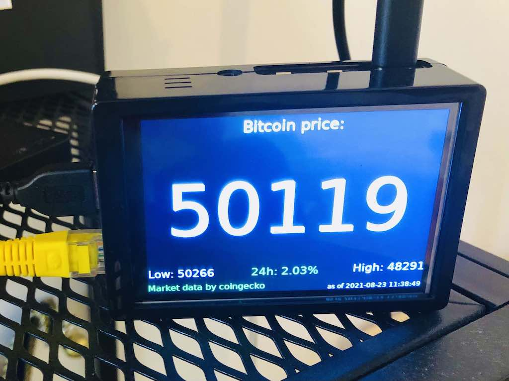
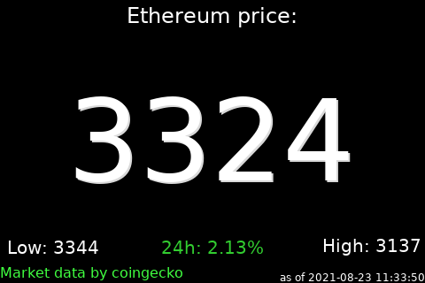
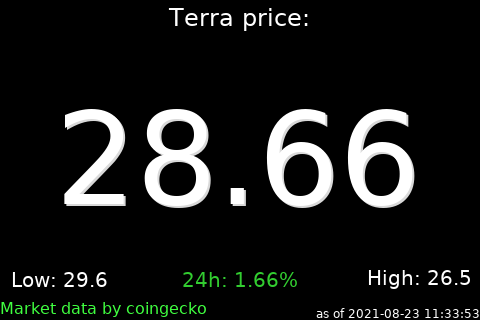

# umbrel-crypto-display
A tool to display crypto prices on the display of your umbrel node.
This project works natively for [Umbrel OS](https://getumbrel.com/)

Inspired from [nodeyez](https://github.com/vicariousdrama/nodeyez)



## Pre-requisites

1. Build yourself a Raspberry Pi Bitcoin Node with [Umbrel OS](https://getumbrel.com/)
 
2. Acquire and install a 3.5" TFT screen. This is [the one](https://amzn.to/3DaFLHK) I bought as I wanted a case, but you can get any from [Amazon](https://amzn.to/3B7QoZQ) with the XPT2046 controller.


## Install

1. Ssh to your umbrel node and clone this repository.
```
git clone https://github.com/lorenzoPrimi/umbrel-crypto-display.git
cd umbrel-crypto-display
sudo bash install.sh
```

2. Reboot your Rasperry Pi
You'll need to reboot after running the install script to enable the GPIO screen.
```
sudo reboot
```

3. Configure the cryptocurrencies you want to track [optional]
```
cd umbrel-crypto-display
./configure.sh
```

4. Start the script (it will ask for the sudo password)
```
cd umbrel-crypto-display
./start.sh
```
This will run the [slideshow.sh](./slideshow.sh) script and add a cronjob to update crypto prices.

To stop the script, execute `./stop.sh` (requires the sudo password)


##  Samples







## ToDo / Plans / Known Issues

This repository is in alpha stage, like the one of [vicariousdrama](https://github.com/vicariousdrama/nodeyez). This means it likely has bugs, and documentation may not fully guide a new user to succesful operation. Users of this repository are invited to provide feedback, in the form of questions, recommendations, bug reports etc.  

This repository works natively with Umbrel OS and will be updated to work with a newer version of it.

There is a plan to make it into an Umbrel native app - ping me for collaboration!
